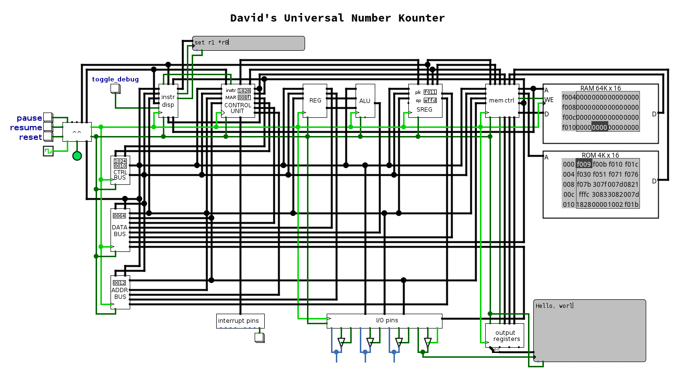

# DUNK — David's Universal Number Kounter

DUNK is a 16-bit microcoded, fully-featured, working CPU with a custom instruction set and a standalone assembler, created in Logisim-evolution, created as an educational project to learn about CPU architecture - and to see if I could.

## Features

- 16-bit word-addressed memory model
- Custom instruction set architecture
- Assembler written in C
- Human-readable assembly syntax
- Full call stack implementation

## Getting Started

Requirements:

- [Logisim Evolution](https://github.com/logisim-evolution/logisim-evolution)

Steps:

1. Open `dunk.circ` in Logisim Evolution.
2. Right-click the RAM unit and choose "Load image...".
3. Select a file file from `examples/bin/`.
4. Start the simulation with `Ctrl+K` or via the Simulate menu.

## Future Plans

- Implement a byte-addressed, 32-bit version in Verilog targeting the Sipeed tang 20k FPGA development board
