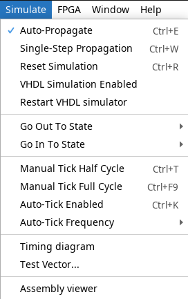

# DUNK — David's Universal Number Kounter

**DUNK** is a 16-bit microcoded CPU architecture designed from scratch, with a custom instruction set, an accompanying assembler, and eventual plans for FPGA implementation. It is byte-addressed, stack-aware, and built with clarity and human-friendliness in mind.

## 🧠 About

DUNK is a microcoded CPU designed as both a learning exercise and a demonstration of low-level architectural principles. It currently exists as a Logisim Evolution schematic and supports:

- A custom 16-bit ISA with word-aligned memory
- Human-readable assembly (designed to be nicer than raw RISC-V style code)
- An accompanying assembler written in C
- Microcoded control logic with deterministic sequencing
- Support for stack-based control flow, aliasing, and macros

> See [`docs/overview.pdf`](./docs/overview.pdf) for a detailed design rationale and architectural overview.

## ⚙️ Current Status

| Component          | Status       |
|-------------------|--------------|
| CPU architecture  | ✔️ Core defined |
| Instruction set   | ✔️ First version complete |
| Assembler         | ✔️ Working prototype  |
| Logisim CPU       | ⚠️ In development (partial implementation) |
| Memory model      | ✔️ 16 bit word addressed |
| Verilog version   | 🚧 Planned |

## 🧪 Try It Out

You’ll need:
- [Logisim Evolution](https://github.com/logisim-evolution/logisim-evolution)

Steps:

1. Open dunk.circ in Logisim Evolution.
2. Right click the RAM module (top right) and select "Load image...".

3. Select an example from the example binary folder "examples/bin".
2. Set the encoding mode to "little endian".

3. Press Ctrl+K or select "Auto-Tick Enabled" under "Simulate".

4. Optionally, change the clock speed under Logisim Evolution's "Simulate" menu.
